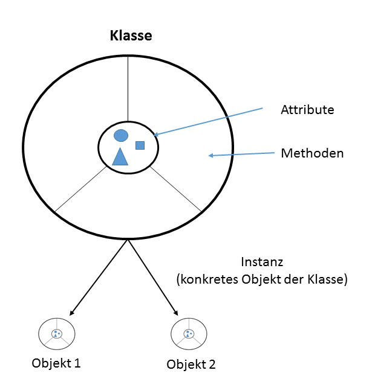

# Objektorientierung
Klassen, Objekte und Instanzen

---

<!-- .slide: class="left" -->
## Kurs Organisation

* [Skript und Übungen](https://github.com/ablersch/software-developer-ihk-modul-2) von GitHub (https://github.com/ablersch)
* [Stundenplan](https://ablersch.github.io/software-developer-ihk-modul-1/Stundenplan_SoftwareDeveloper.pdf)

--

<!-- .slide: class="left" -->
## Hintergrund der objektorientierten Programmierung

**Definition Objektorientierung**: Eine Sichtweise auf ein System, das durch das Zusammenspiel kooperierender Objekte beschrieben wird.

* Zusammengehörende Teile werden beim programmieren zusammen verwaltet.
* Um zur Lösung eines Problems zu kommen, versucht man einzelne Objekte (Klassen) in der Problemstellung zu erkennen.
* Die Objekte werden mit den zugehörigen Daten und Methoden, die sie beschreiben, nachgebildet.

---

<!-- .slide: class="left" -->
## Vorteile der objektorientierten Programmierung

* Der Schutz von Daten verbessert sich durch die Kapselung der Daten und Methoden.
* Die Fehlersuche wird durch die kompakte Struktur der Objekte vereinfacht.
* Quellcode wird überschaubarer.
* Änderungen können einfacher vorgenommen werden.
* Neue Klassen können leichter in die Anwendung eingebunden werden.
* Objekte werden nur dann erzeugt wenn diese benötigt werden (Effizienter Umgang mit Speicherplatz).

---

<!-- .slide: class="left" -->
## Objektorientierung


Mehr zum Thema [objektorientierte Programmierung](https://entwickler.de/online/development/einfuehrung-programmierung-objektorientierte-programmentwicklung-197372.html)

---

<!-- .slide: class="left" -->
## Klassen

*Eine Klasse ist ein Modell auf dessen Basis Objekte erstellt werden.*

* In einer Klasse werden Attribute und zugehörige Methoden vereint.

* Da die Attribute und Methoden zur Klasse gehören spricht man von **Klassenmember**.

* Objekte (Instanzen) stellen konkrete Exemplare der Klasse dar.

* Auf Basis einer Klasse können beliebig viele Objekte erzeugt
    (instanziiert) werden.

---

<!-- .slide: class="left" -->
### Syntax der Klassendefinition

* Die Klassendeklaration beginnt mit dem Schlüsselwort **class**.

* Bei Bedarf kann ein Zugriffsmodifizierer vorangestellt werden. Wird keiner vorangestellt, wird die Klasse als **internal** deklariert.

* Anschließend folgt der Klassenname, dieser beginnt üblicherweise mit einem Großbuchstaben.

* In der geschweiften Klammer folgt die Definition der Member.

* Eine Klasse kann Variablen, Konstante und Methoden enthalten.

* Auch den Klassenmember können Modifizierer vorangestellt werden. Ohne Angabe werden die Elemente als **private** deklariert.

* Mehr zum Thema [Klassen](https://docs.microsoft.com/de-de/dotnet/csharp/programming-guide/classes-and-structs/classes)

---

<!-- .slide: class="left" -->
### Zugriffsmodifizierer

Die Zugriffsmodifizierer steuern die Sichtbarkeit der Variablen, Eigenschaften und
Methoden einer Klasse in C\#. Sie heißen:

**private:**

* Der Zugriff auf das Element ist nur innerhalb der Klasse möglich. `private` ist die Standardeinstellung.

**protected:**

* Zugriff innerhalb der Klasse und von allen davon abgeleiteten Klassen.

**internal:**

* Der Zugriff auf das Element ist innerhalb der Assembly (Programm, Klassenbibliothek) möglich.

**public:**

* Der Zugriff auf das Element ist nicht eingeschränkt.

---

<!-- .slide: class="left" -->
### Unsere erste Klasse

Enthält Variablen und Methoden.

```csharp []
public class Person
{
    private string vorname;
    private string nachname;
    public int alter;

    public string GetName()
    {
        return $"{vorname} {nachname}";
    }
}
```

Note: 
Eine Klasse wird definiert mit `class`.
Es ist üblich jede Klasse in eine eigene Daeti zu schreiben. Der Name der Datei ist identisch zum Klassenname.

---

<!-- .slide: class="left" -->
### Klasseninstanzen (Objekte) erzeugen

* In C\# werden Instanzen (Objekte) einer Klasse **immer** dynamisch mit **new** erzeugt.

* Speicherplatz wird erst beim Anlegen der Instanzen reserviert.

* Erzeugen eines Objekts:

```csharp []
Person meinePerson;
meinePerson = new Person();
```

---

<!-- .slide: class="left" -->
### Zugriff auf die Member eines Objekts

Der Zugriff auf die Member (Attribute) eines Objekts erfolgt über den
Punktoperator.

```csharp []
meinePerson.alter = 20;
```

Note:

* **VS** Klasse erzeugen und nutzen. 
* In **VS** zeigen, Sichtbarkeit von Variablen (Klassenvariable, Variable in Methode, in Schleife) als Wdh
* **ÜBUNG 1** Medienverwaltung 2

---

<!-- .slide: class="left" -->
### Was ist Kapselung

* Die Attribute (Variablen) werden in einer Klasse eingeschlossen und nach außen abgeschirmt (mit Zugriffsmodifizierer).

* Nur Methoden und Eigenschaften (Properties) einer Klasse haben darauf Zugriff.

* Werte können beim schreiben geprüft und verändert werden.

* Werte können beim lesen verändert und aufbereitet werden.

Note: Prüfen auf Schwellwerte oder entfernen von Leerzeichen

---

<!-- .slide: class="left" -->
### Darstellung Kapselung



Note:

* Variablen sind nur intern nutzbar wenn diese private sind.
* Methoden sind meist nach außen sichtbar und greifen auf die geschützten Variablen zu.

---

<!-- .slide: class="left" -->
### Eigenschaften

Um die Kapselung zu erreichen werden die Attribute **private** deklariert. Der Zugriff erfolgt über eine [Property (Eigenschaft)](https://docs.microsoft.com/de-de/dotnet/csharp/programming-guide/classes-and-structs/properties).

```csharp []
public class Person
{
    private string vorname;
    private string nachname;
    private int alter;

    public int Alter // Eigenschaft (Property)
    {
        get { return alter; }
        set { alter = value; } // value beinhaltet den übergebenen Wert
    }

    // Alternative: Expression-bodied members (return nicht notwendig)
    //public int Alter
    //{
    //    get => alter;
    //    set => alter = value;
    //}

    // Alternative: Automatic Property
    // Dabei ist auch keine Klassenvariable mehr notwendig
    // public int Alter { get; set; }
}
```

Note:

* **VS** Eigenschaft zeigen mit automa. Generierung
* Zuweisung eines Wertes, wie bei einer Variable (nicht a.SetName("aa"))

In einer Eigenschaft sind getter und setter inkludiert.

* Werte können beim lesen und schreiben geprüft bzw bearbeitet werden
* Schreib- oder Lesezugriff einschränkbar
* Name mit Großbuchstabe (wie Klasse)

<!-- .slide: class="left" 
## Klassen- & Instanzvariablen

Je nach Gültigkeit unterscheidet man in Instanz- und Klassenvariablen.\
Der Unterschied ist gut zu erkennen am Beispiel eines Objektzählers.

* **Instanzvariablen**
    Variablen die nur innerhalb von Objekten gültig sind.

```csharp
public int count;
```

* **Klassenvariablen**
Variablen die unabhängig von Objekten existieren.

```csharp
public static int classCount;
```

**Zugriff außerhalb der Klasse:**

```csharp
Person meinObjekt = new Person();
int c = meinObjekt.count;
int cClass = Person.classCount;
```
-->

---

<!-- .slide: class="left" -->
### Objektreferenz `this`

* Zusammen mit jedem Objekt wird vom Compiler automatisch eine Objektreferenz auf das eigene Objekt erzeugt.

* Diese Referenzvariable [this](https://docs.microsoft.com/de-de/dotnet/csharp/language-reference/keywords/this) kann in allen Methoden des Objekts eingesetzt werden.

* Kennzeichnet das aktuelle Objekt.

Note: Sich selbst als Parameter übergeben.

Identifizieren von Variablen mit gleichem Namen

---

<!-- .slide: class="left" -->
#### Beispiel

```csharp []
using System;

namespace Objektreferenz
{
    class Person
    {
        private string vorname;
        private string nachname;
        private int alter;

        public void Anlegen(string vorname, string nachname, int alter)
        {
            this.nachname = nachname;
            this.vorname = vorname;
            this.alter = alter;
        }
    }

    class Program
    {
        static void Main(string[] args)
        {
            Person hugo = new Person();
            hugo.Anlegen("Hugo", "Musterhugo", 33);
            Console.Read();
        }
    }
}
```

---

<!-- .slide: class="left" -->
## Konstruktor & Destruktor

Jede Klasse enthält mindestens einen Konstruktor und einen Destruktor (Finalizer). Bei der Erzeugung eines Objekts wird automatisch der Konstruktor aufgerufen. Innerhalb des Konstruktors können dann zum Beispiel Attribute der Klasse initialisiert oder Variablen mit Standardwerten belegt werden.

Der Destruktor zerstört die vom Konstruktor erzeugte Instanz des Objekts und gibt somit den Speicherplatz wieder frei.

Der Compiler stellt für jede Klasse automatisch einen parameterlosen
Konstruktor und Destruktor bereit. Es können eigene Konstruktoren und Destruktoren, mit erweiterter Funktionalität, programmiert werden.

---

<!-- .slide: class="left" -->
### Konstruktor

* Der [Konstruktor](https://docs.microsoft.com/de-de/dotnet/csharp/programming-guide/classes-and-structs/constructors) ist eine spezielle Methode einer Klasse (kann aber nicht manuell aufgerufen werden)

* Der Konstruktor wird **automatisch beim Instanziieren** (Erzeugen) eines Objekts aufgerufen.

* Wird innerhalb der Klasse vom Programmierer **kein Konstruktor formuliert**, so wird automatisch der **Standard-Konstruktor** (ohne Parameter) aufgerufen.

---

<!-- .slide: class="left" -->

* Der Konstruktor ist eine Methode, die **immer** den Namen der Klasse besitzt.

* Er liefert **keinen** Wert zurück, **auch nicht void!**

* Er kann nicht wie eine andere Methode aufgerufen werden, sondern wird immer automatisch beim Erzeugen eines Objekts aufgerufen.

* Der Konstruktor ist außerhalb der Klasse aufrufbar, deshalb **muss** er als **public** definiert werden.

* Auch Konstruktoren können überladen werden, es können verschiedene Parameterlisten mitgegeben werden.<br/>
--> Bei der Erzeugung eines Objekts **müssen die Parameter mit übergeben werden**.

Note: private Konstruktor: wenn die Klasse nicht initialisiert werden soll

---

<!-- .slide: class="left" -->
#### Syntax

**Standard-Konstruktor welcher automatisch aufgerufen wird:**

```csharp []
class Person
{
    // Gleicher Name wie die Klasse und kein Rückgabewert
    public Person()
    {
    }
}
```

**Definition des Standard-Konstruktor:**

```csharp []
string name;
string vorname;

public Person()
{
    // Initialisierung mit festen Werten
    name = "Name unbekannt";
    vorname = "Vorname unbekannt";
}
```

---

<!-- .slide: class="left" -->
#### Beispiel Konstruktor

```csharp []
    class Person
    {
      private string name;
      private string vorname;

      public Person()  // Standard-Konstruktor
      {
        name = "unbekannt";
        vorname = "unbekannt";
      }

      public Person(string nachname, string vorname)
      {
        name = nachname;
        this.vorname = vorname;
      }
    }
```

Note: Werden Konstruktoren definiert gibt es kein Standard-Konstruktor mehr.

---

<!-- .slide: class="left" -->
#### Beispiel

```csharp []
class Fahrzeug
{
    public int Geschwindigkeit { get; set; } // Property/Eigenschaft

    public Fahrzeug(int wert)
    {
        Geschwindigkeit = wert;
    }

    public Fahrzeug() : this(0) // Verweis auf den Konstruktor mit einem Parameter
    {
    }
}

class Program
{
    static void Main(string[] args)
    {
        Fahrzeug audi = new Fahrzeug();
        var bmw = new Fahrzeug(38);
        Console.WriteLine($"Geschwindigkeit Audi: {audi.Geschwindigkeit} km/h");
        Console.WriteLine($"Geschwindigkeit Bmw: {bmw.Geschwindigkeit} km/h");
    }
}
```

Note:

* Anderer überladener Konstruktor wird zuerst mit `this` aufgerufen. Danach wird der restliche Code durchlaufen.
* Initialisierungscode sollte in nur einem Konstruktor sein der von anderen aufgerufen wird.
* **VS** Konstruktor zeigen (Klasse erstellen mit zwei Konstruktoren. Der Konstruktor mit einem Wert ruft den anderen Konstruktor mit zwei Werten auf).

---

<!-- .slide: class="left" -->
### Destruktor (Finalizer)

* Der [Destruktor (Finalizer)](https://docs.microsoft.com/de-de/dotnet/csharp/programming-guide/classes-and-structs/destructors) einer Klasse wird beim **Zerstören** eines Objekts aufgerufen.

* Er besitzt **keine Parameter**, keine Zugriffsmodifizierer und kann **nicht überladen** werden.

* Destruktoren werden verwendet, wenn vor der Zerstörung des Objekts noch Aktionen ausgeführt werden müssen.

* Freigabe von dynamisch allokiertem Speicher oder Abspeichern einer Datei vor dem Schließen.

* Der Destruktor besitzt den selben Namen wie die Klasse nur mit vorangestellter Tilde "\~".

* Er kann nicht direkt aufgerufen werden.

---

<!-- .slide: class="left" -->
#### Syntax

```csharp []

class Person
{
    ...
    // Destruktor
    ~Person()
    {
    }
}
```

Note: **ÜBUNG 2** Intervall und **ÜBUNG 3** Sekundenspeicher