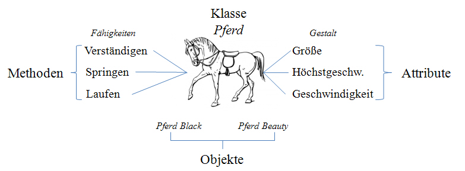

# Objektorientierung

Klassen, Objekte und Instanzen

---

<!-- .slide: class="left" -->
## Kurs Organisation

* [Skript und Übungen](https://github.com/ablersch/software-developer-ihk-modul-2) von GitHub (https://github.com/ablersch)
* [Stundenplan](https://ablersch.github.io/software-developer-ihk-modul-1/Stundenplan_SoftwareDeveloper.pdf)

---

<!-- .slide: class="left" -->
## Was ist Objektorientierung

Objektorientierung (OO) ist ein Programmierparadigma, das darauf abzielt, Programme in Form von Objekten zu strukturieren, die Daten (Eigenschaften) und Verhalten (Methoden) kombinieren. 

In C# wird die objektorientierte Programmierung (OOP) durch Klassen und Objekte umgesetzt.

**Definition Objektorientierung**: Eine Sichtweise auf ein System, das durch das Zusammenspiel kooperierender Objekte beschrieben wird.


Durch Objektorientierung lassen sich komplexe Probleme einfach in Code übersetzen und klar strukturieren.

---

<!-- .slide: class="left" -->
## Grundkonzepte der Objektorientierung

**Klassen:** 
* Eine Klasse ist eine Vorlage oder ein Bauplan für Objekte. 
* Sie definiert, welche Eigenschaften und Methoden ein Objekt haben wird. 
* z.B.: Klasse "Auto" mit Eigenschaften wie Marke, Modell und Baujahr.

**Objekte:** 
* Ein Objekt ist eine Instanz einer Klasse. 
* Wenn wir z.B. ein Objekt der Klasse "Auto" erzeugen, erstellen wir ein spezielles Auto mit bestimmten Eigenschaften (z.B. ein roter VW Golf, Baujahr 2020).

**Kapselung:** 
* Kapselung bedeutet, dass die Daten eines Objekts vor direktem Zugriff von außen geschützt werden. 
* Dies wird oft durch private Felder und öffentliche Methoden erreicht. So können Daten nur auf kontrollierte Weise verändert werden.

Note:

* Zusammengehörende Teile werden beim programmieren zusammen verwaltet.
* Um zur Lösung eines Problems zu kommen, versucht man einzelne Objekte (Klassen) in der Problemstellung zu erkennen.
* Die Objekte werden mit den zugehörigen Daten und Methoden, die sie beschreiben, nachgebildet.

---

<!-- .slide: class="left" -->
## Vorteile der objektorientierten Programmierung

**Strukturierung und Wartbarkeit:** OOP hilft, den Code klar zu strukturieren, da verwandte Daten und Methoden in einer Klasse zusammengefasst sind. Das erleichtert die Wartung und Lesbarkeit des Codes.

**Wiederverwendbarkeit:** Durch Klassen und Vererbung können Teile des Codes wiederverwendet werden. Einmal geschriebene Klassen können in anderen Projekten ohne Anpassungen verwendet werden.

**Erweiterbarkeit:** Neue Klassen können leicht erstellt und in das bestehende System integriert werden. Auch bestehende Klassen lassen sich oft problemlos erweitern.

**Fehlervermeidung durch Kapselung:** Durch Kapselung werden unkontrollierte Veränderungen der Daten eines Objekts verhindert, was die Zuverlässigkeit und Stabilität des Codes erhöht.

Note:

* Objekte werden nur dann erzeugt wenn diese benötigt werden (Effizienter Umgang mit Speicherplatz).
* Die Fehlersuche wird durch die kompakte Struktur der Objekte vereinfacht.
  
---

<!-- .slide: class="left" -->
## Beispiel Objektorientierung



Mehr zum Thema [objektorientierte Programmierung](https://entwickler.de/online/development/einfuehrung-programmierung-objektorientierte-programmentwicklung-197372.html)

---

<!-- .slide: class="left" -->
## Klassen

*Eine Klasse ist ein Modell auf dessen Basis Objekte erstellt werden.*

* In einer Klasse werden Felder, Eigenschaften und zugehörige Methoden vereint.

* Da die Felder, Eigenschaften und Methoden zur Klasse gehören spricht man von Klassenmember.

* Objekte (Instanzen) stellen konkrete Exemplare der Klasse dar.

* Auf Basis einer Klasse können beliebig viele Objekte erzeugt (instanziiert) werden.

---

<!-- .slide: class="left" -->
### Syntax der Klassendefinition

* Die Klassendeklaration beginnt mit dem Schlüsselwort `class`.

* Bei Bedarf kann ein Zugriffsmodifizierer vorangestellt werden. Wird keiner vorangestellt, wird die Klasse als `internal` deklariert.

* Anschließend folgt der Klassenname, dieser beginnt üblicherweise mit einem Großbuchstaben.

* In der geschweiften Klammer folgt die Definition der Klassenmember.

* Eine Klasse kann Felder, Eigenschaften, Konstanten und Methoden enthalten.

* Den Klassenmembern können Zugriffsmodifizierer vorangestellt werden. Ohne Angabe werden diese als `private` deklariert.

* Mehr zum Thema [Klassen](https://docs.microsoft.com/de-de/dotnet/csharp/programming-guide/classes-and-structs/classes)

---

<!-- .slide: class="left" -->
### Zugriffsmodifizierer

In C# gibt es mehrere Zugriffsmodifizierer, die den Zugriff auf Klassen, Methoden und andere Typen innerhalb des Codes steuern. Sie bestimmen, wo und wie auf Elemente zugegriffen werden kann.

**`private`:**

* Der Zugriff auf das Element ist nur innerhalb der Klasse möglich. Es ist von außen nicht zugänglich.

**`protected`:**

* Zugriff innerhalb der Klasse und von allen davon abgeleiteten Klassen.

---

<!-- .slide: class="left" -->
### Zugriffsmodifizierer

**`internal`:**

* Der Zugriff auf das Element ist nur innerhalb derselben Assembly möglich. Es kann nicht von einer anderen Assembly aus zugegriffen werden.

**`public`:**

* Das Element ist überall sichtbar und kann von jeder anderen Klasse und Assembly verwendet werden. Der Zugriff auf das Element ist nicht eingeschränkt.

Note:
Es gibt noch: 
* `protected internal`: Ist sowohl in abgeleiteten Klassen als auch innerhalb derselben Assembly sichtbar.
* `private protected`: Ist nur innerhalb der Klasse und von abgeleiteten Klassen innerhalb derselben Assembly zugänglich.

---

<!-- .slide: class="left" -->
### Unsere erste Klasse

```csharp []
public class Person // Definition der Klasse.
{
    // Alle Felder, Eigenschaften und Methoden sind Klassenmember.
    private string vorname; // Feld (nur innerhalb der Klasse zugreifbar).
    private string nachname;

    public int alter; // öffentliches Feld (auch von außerhalb der Klasse zugreifbar).

    public string GetName() // Methode welche die Klasse bereitstellt.
    {
        return $"{vorname} {nachname}";
    }
}

public class Program
{
    private static void Main(string[] args)
    {
        Person nameMeinerVariable = new Person();
    }
}
```

Note: 
* Eine Klasse wird definiert mit `class`.
* Es ist üblich jede Klasse in eine eigene Datei zu schreiben. Der Name der Datei ist identisch zum Klassenname.
* Instanzen (Objekte) einer Klasse werden mit `new` erzeugt.
* **VS** 
  * Klasse erzeugen und nutzen. 
  * Feld nutzen.
  * Leeres Klassenobjekt, prüfen auf `null`.
* **ÜBUNG 1** Medienverwaltung 2

---

<!-- .slide: class="left" -->
### Eigenschaft (Property)

Eine [Eigenschaft](https://docs.microsoft.com/de-de/dotnet/csharp/programming-guide/classes-and-structs/properties) ist eine spezielle Methode, die den Zugriff auf die Daten einer Klasse kontrolliert. 

Sie ähnelt einem Feld, das Daten speichert, erlaubt jedoch zusätzliche Logik beim Lesen oder Schreiben der Daten, z.B. zur Validierung oder Formatierung. 

Eigenschaften helfen dabei, Daten sicher und kontrolliert verfügbar zu machen, ohne dass die internen Felder der Klasse direkt von außen verändert werden können (Kapselung).

```csharp
public class Person
{
    private int alter; // Feld

    public int Alter // Eigenschaft (erlaubt den Zugriff von außen)
    {
        get { return alter; }
        set { alter = value; } // Value beinhaltet den übergebenen Wert
    }
}
```

Note:

* In anderen Programmiersprachen werden dazu Getter und Setter verwendet. Vorteile Property:
  * Klarere und lesbarere Syntax, Zugriff wie auf eine Variable.
  * Einheitlicher Zugriff, egal ob lesend oder schreibend.
  * Datenbindung in UI (WPF)
  * Serialisierung erwartet Property und keine Methode
* Eigenschaft besteht aus einem `get`- (Getter) und einem `set`-Accessor (Setter).
  * Werte können beim schreiben geprüft und verändert werden.
  * Werte können beim lesen verändert und aufbereitet werden.

---

<!-- .slide: class="left" -->
### Auto-Property

Eigenschaften können automatisch erstellt werden, wenn keine zusätzliche Logik benötigt wird. Das vereinfacht den Code:

```csharp
public class Person
{
    // Auto-Property, dabei ist kein Feld mehr notwendig.
    public int Alter { get; set; }
}
```

Note: 
* Schreibzugriff kann entfernt werden wenn der Setter entfernt wird. 
* Schreiben nur noch über den Konstruktor.

---

<!-- .slide: class="left" -->
### Beispiel für eine Prüfung im Setter:

```csharp
public class Person
{
    private int alter;

    public int Alter
    {
        get { return alter; }
        set
        {
            if (value < 0)
            {
                alter = 0;
            } 
            else 
            {
                alter = value;
            }
        }
    }
}

```

In diesem Beispiel stellt die Alter-Eigenschaft sicher, dass der Wert nicht negativ sein kann.

Note:

* Prüfen auf Schwellwerte oder entfernen von Leerzeichen
* Schreib- oder Lesezugriff einschränkbar
* Name mit Großbuchstabe (wie Klasse)

---

<!-- .slide: class="left" -->
### Zugriff auf die Eigenschaft

Der Zugriff auf die Eigenschaft eines Objekts erfolgt über den
Punktoperator.

```csharp
meinePerson.Alter = 20;
```

Note:

* **VS** 
  * Eigenschaft nutzen.
  * Wert einer Eigenschaft zuweisen.
  * Prüfen auf leeren String in der Eigenschaft.
  * Sichtbarkeit von Variablen (Felder, Eigenschaften, Methoden) als Wdh
  * * **ÜBUNG 2** Sekundenspeicher

---

<!-- .slide: class="left" -->
### Warum Eigenschaften verwenden?

* **Kapselung & Kontrolle:** Properties ermöglichen es, den Zugriff auf Felder zu steuern, z. B. durch `get`- und `set`-Methoden.
* **Automatische Properties:** Wenn keine zusätzliche Logik nötig ist, kann man Auto-Properties nutzen.
* **Read-Only & Schreibschutz:** Properties ermöglichen z. B. nur lesbaren Zugriff (`get` ohne `set`).
* **Getter-Logik & Berechnete Werte:** Ein Property kann einen Wert berechnen, anstatt ihn direkt zu speichern.
* **Datenbindung & Serialisierung**
    * **WPF, WinForms & Blazor:** Properties ermöglichen Datenbindung (`INotifyPropertyChanged`).
    * **JSON/XML-Serialisierung:** Properties sind oft nötig, weil viele Serializer keine Felder unterstützen

**Wann sind Felder sinnvoll?**
* In privaten, internen Kontexten, wenn keine zusätzliche Logik nötig ist.
* In Performance-kritischen Bereichen, wo der Overhead von Properties vermieden werden soll.
* Bei Readonly-Feldern (`readonly int myField;`), die nur im Konstruktor gesetzt werden.

---

<!-- .slide: class="left" -->
### Objektreferenz `this`

* Zusammen mit jedem Objekt wird vom Compiler automatisch eine Objektreferenz auf das eigene Objekt erzeugt.

* Diese Referenzvariable [`this`](https://docs.microsoft.com/de-de/dotnet/csharp/language-reference/keywords/this) kann in allen Methoden des Objekts eingesetzt werden.

* Kennzeichnet das aktuelle Objekt.

Note: 
* Identifizieren von Variablen mit gleichem Namen (Beispiel unten)
* Sich selbst als Parameter übergeben (Beispiel im Link)

---

<!-- .slide: class="left" -->
#### Beispiel

```csharp []
namespace Objektreferenz
{
    class Person
    {
        private string vorname;
        private string nachname;
        private int alter;

        public void Anlegen(string vorname, string nachname, int alter)
        {
            this.nachname = nachname;
            this.vorname = vorname;
            this.alter = alter;
        }
    }

    class Program
    {
        static void Main(string[] args)
        {
            Person max = new Person();
            hugo.Anlegen("Max", "Mustermann", 33);
        }
    }
}
```

---

<!-- .slide: class="left" -->
## Konstruktor & Destruktor

Jede Klasse enthält mindestens einen Konstruktor und einen Destruktor (Finalizer). Bei der Erzeugung eines Objekts wird automatisch der Konstruktor aufgerufen. Innerhalb des Konstruktors können Felder oder Eigenschaften der Klasse initialisiert werden.

Der Destruktor zerstört die vom Konstruktor erzeugte Instanz des Objekts und gibt somit den Speicherplatz wieder frei.

Der Compiler stellt für jede Klasse automatisch einen parameterlosen Konstruktor und Destruktor bereit. Es können eigene Konstruktoren und Destruktoren, mit erweiterter Funktionalität, programmiert werden.

---

<!-- .slide: class="left" -->
### Konstruktor

* Der [Konstruktor](https://docs.microsoft.com/de-de/dotnet/csharp/programming-guide/classes-and-structs/constructors) ist eine spezielle Methode einer Klasse (kann aber nicht manuell aufgerufen werden)

* Der Konstruktor wird automatisch beim Instanziieren (Erzeugen) eines Objekts aufgerufen.

* Wird innerhalb der Klasse vom Programmierer kein Konstruktor formuliert, so wird automatisch der Standard-Konstruktor (ohne Parameter) aufgerufen.

---

<!-- .slide: class="left" -->

* Der Konstruktor ist eine Methode, die immer den Namen der Klasse besitzt.

* Er liefert keinen Wert zurück, auch nicht `void`!

* Er kann nicht wie eine andere Methode aufgerufen werden, sondern wird immer automatisch beim Erzeugen eines Objekts aufgerufen.

* Der Konstruktor ist außerhalb der Klasse aufrufbar, deshalb muss er als `public` definiert werden.

* Auch Konstruktoren können überladen werden, es können verschiedene Parameter mitgegeben werden.<br/>
Bei der Erzeugung eines Objekts müssen die Parameter mit übergeben werden.

Note: 
`private` Konstruktor: wenn die Klasse nicht initialisiert werden soll

---

<!-- .slide: class="left" -->
#### Syntax

**Standard-Konstruktor welcher automatisch aufgerufen wird:**

```csharp
class Person
{
    // Gleicher Name wie die Klasse und kein Rückgabewert
    public Person()
    {
    }
}
```

**Definition des Standard-Konstruktor:**

```csharp
string name;
string vorname;

public Person()
{
    // Initialisierung mit festen Werten
    name = "Name unbekannt";
    vorname = "Vorname unbekannt";
}
```

---

<!-- .slide: class="left" -->
#### Beispiel Konstruktor

```csharp []
    class Person
    {
      private string name;
      private string vorname;

      public Person()  // Standard-Konstruktor
      {
        name = "unbekannt";
        vorname = "unbekannt";
      }

      public Person(string nachname, string vorname)
      {
        name = nachname;
        this.vorname = vorname;
      }
    }
```

Note: 
Werden Konstruktoren definiert gibt es kein Standard-Konstruktor mehr.

---

<!-- .slide: class="left" -->
#### Beispiel

```csharp []
class Fahrzeug
{
    public int Geschwindigkeit { get; set; }

    public Fahrzeug(int wert)
    {
        Geschwindigkeit = wert;
    }

    public Fahrzeug() : this(0) // Verweis auf den Konstruktor mit einem Parameter
    {
    }
}

class Program
{
    static void Main(string[] args)
    {
        Fahrzeug audi = new Fahrzeug();
        var bmw = new Fahrzeug(38);
        Console.WriteLine($"Geschwindigkeit Audi: {audi.Geschwindigkeit} km/h");
        Console.WriteLine($"Geschwindigkeit Bmw: {bmw.Geschwindigkeit} km/h");
    }
}
```

Note:
* Anderer überladener Konstruktor wird zuerst mit `this` aufgerufen. Danach wird der restliche Code durchlaufen.
* Initialisierungscode sollte in nur einem Konstruktor sein der von anderen aufgerufen wird.
* **VS** Konstruktor zeigen 
  * Klasse erstellen mit zwei Konstruktoren. 
  * Der Konstruktor mit einem Wert ruft den anderen Konstruktor mit zwei Werten auf.

---

<!-- .slide: class="left" -->
### Destruktor (Finalizer)

* Der [Destruktor (Finalizer)](https://docs.microsoft.com/de-de/dotnet/csharp/programming-guide/classes-and-structs/destructors) einer Klasse wird beim Zerstören eines Objekts aufgerufen.

* Er besitzt keine Parameter, keine Zugriffsmodifizierer und kann nicht überladen werden.

* Destruktoren werden verwendet, wenn vor der Entsorgung (Dispose) des Objekts noch Aktionen ausgeführt werden sollen.

* Freigabe von Ressourcen oder Abspeichern einer Datei vor dem Schließen.

* Der Destruktor besitzt den selben Namen wie die Klasse nur mit vorangestellter Tilde "\~".

* Er kann nicht direkt aufgerufen werden.

---

<!-- .slide: class="left" -->
#### Syntax

```csharp
class Person
{
    ...
    // Destruktor
    ~Person()
    {
    }
}
```

Note: 
* `person.Dispose()`
* **ÜBUNG 3** Intervall 