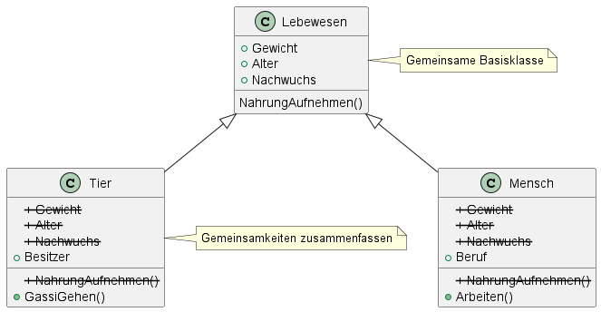
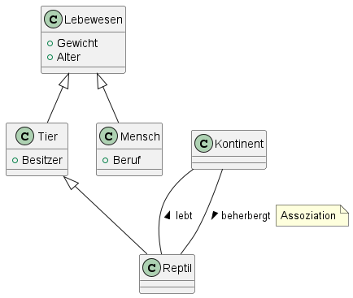
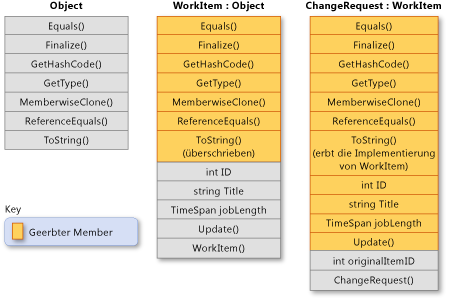

# Vererbung

Die Vererbung ermöglicht es, neue Klassen zu erstellen, die das in anderen Klassen definierte Verhalten wiederverwenden, erweitern und ändern.

---

<!-- .slide: class="left" -->
## Problemstellung

Oft werden mehrere Klassen benötigt, die in weiten Teilen gleiche Funktionalitäten bereitstellen und gleiche Eigenschaften haben.

Zum Beispiel bei den Klassen **Mensch** und **Tier**.

* viel Schreibarbeit
* mehrfacher Code
* bei Änderungen müssen alle Klassen angepasst werden

**Lösung:**

Man versucht, zu ähnlichen Klassen, eine gemeinsame **Oberklasse** zu finden die alle Gemeinsamkeiten beinhaltet. In den **Unterklassen** werden lediglich die Unterschiede ergänzt.

---

<!-- .slide: class="left" -->
## Vererbung



---

<!-- .slide: class="left" -->
## Vererbung

Die Vererbung (Ableitung) erlaubt die Definition neuer Klassen auf der Basis von bestehenden Klassen. Dabei werden Eigenschaften und Methoden übernommen.

Die Klasse deren Member vererbt werden, wird **Basisklasse/Elternklasse/Oberklasse** genannt, und die Klasse, die diese Member erbt, wird **abgeleitete Klasse/Kindklasse/Unterklasse** genannt.

**Beispiel:** Eine Basisklasse **Lebewesen** kann eine abgeleitete Klasse **Tier** und eine weitere abgeleitete Klasse **Reptil** haben. Also ein Reptil ist ein Tier und ein Tier ist ein Lebewesen.

Note: Person

Mitarbeiter        Kunde

fest Angestellter     Leiharbeiter

---

<!-- .slide: class="left" -->
## Beispiel



Note: 
* **Ist ein** oder **ist eine Art von**
* Assoziation = Beziehung, keine Vererbung
* **ÜBUNG 4** Klassendiagramm

---

<!-- .slide: class="left" -->
## Beispiel



Note: 
* Konstruktor und private Elemente werden nicht vererbt.
* ChangeRequest kann alle Methoden und Variablen der Basisklasse verwenden

---

<!-- .slide: class="left" -->
## Syntax

```csharp
class <abgeleitete Klasse> : <Basisklasse>
{
    ...
}
```

Die Implementierung der Vererbung in C\#

```csharp
class Mensch : Lebewesen
{
    ...
}
```

---

<!-- .slide: class="left" -->
## Vererbung und Konstruktoren

* Es werden keine Konstruktoren vererbt!

* Von der abgeleiteten Klasse wird der parameterlose Konstruktor der Basisklasse aufgerufen wenn kein anderer Konstruktor definiert wurde.

* Besitzt die Basisklasse einen Konstruktor mit Parameter (und keinen ohne Parameter) wird dieser nicht aufgerufen. In diesem Fall muss (wenn ein Konstruktor nötig ist) der Konstruktor aus der abgeleiteten Klasse explizit aufgerufen werden.

```csharp
: base(Parameter)
```

---

<!-- .slide: class="left" -->
### Base

Um aus einer abgeleiteten Klasse auf die Basisklasse zuzugreifen kann das Schlüsselwort [`base`](https://docs.microsoft.com/de-de/dotnet/csharp/language-reference/keywords/base) verwendet werden.

* Einen Konstruktor der Basisklasse aufrufen:

```csharp
public Person(string beruf, string name, int alter) : base(name, alter)
```

* Auf eine Methode oder Eigenschaft der Basisklasse zugreifen:

```csharp
base.Name = "Fritz";
```

Note: 

* **VS** Beispiel Vererbung
* **VS** zeigen:
    * Reihenfolge von Konstruktoraufrufe
    * Klasse erstellen mit zwei Methoden
    * Aufruf der Methoden
    * Aufruf Konstruktor
* **ÜBUNG 5** Medienverwaltung Aufgabe 3

---

<!-- .slide: class="left" -->
## Virtual

`Virtual` und `override` ermöglichen, dass Methoden und Eigenschaften in abgeleiteten Klassen angepasst oder ersetzt werden können.

Das Schlüsselwort [`virtual`](https://docs.microsoft.com/de-de/dotnet/csharp/language-reference/keywords/virtual) wird in einer Basis-Klasse verwendet, um anzugeben, dass eine Methode in einer abgeleiteten Klasse überschrieben werden kann.

```csharp
public class Tier
{
    public virtual void LautGeben()
    {
        Console.WriteLine("Das Tier macht ein Geräusch.");
    }
}

```

Note: 
* Die Methode `LautGeben` in der Klasse `Tier` kann von einer abgeleiteten Klasse überschrieben werden.
* Wird sie nicht überschrieben, bleibt die Standardimplementierung erhalten.
* (Polymorphismus: Ermöglicht es, eine Methode je nach Typ der Instanz unterschiedlich auszuführen.)

---

<!-- .slide: class="left" -->
## Override

Das Schlüsselwort [`override`](https://docs.microsoft.com/de-de/dotnet/csharp/language-reference/keywords/override) wird in einer abgeleiteten Klasse verwendet, um eine `virtual`-Methode der Basis-Klasse zu überschreiben (erweitert bzw ändert Funktion der Basisklasse).

```csharp
public class Hund : Tier
{
    public override void LautGeben()
    {
        Console.WriteLine("Der Hund bellt: Wuff!");
    }
}

```

Note:
* Die Methode `LautGeben` wird in der Klasse `Hund` überschrieben.
* Jetzt verwendet `Hund` seine eigene Version der Methode, anstatt die der Basis-Klasse.
* `override` funktioniert nur, wenn die Basis-Klasse die Methode als `virtual`, `abstract` oder `override` definiert hat.

---

<!-- .slide: class="left" -->
## Abstract

Mit [`abstract`](https://docs.microsoft.com/de-de/dotnet/csharp/language-reference/keywords/abstract) kann angegeben werden dass die Klasse nur als Basisklasse verwendet werden kann (es darf keine Instanz erstellt werden). Klassen die von einer abstrakten Klasse erben müssen alle Klassenmember die `abstract` sind implementieren und haben keine Implementierung von Code sondern nur die Definition!

Wenn die Basis-Klasse keine Implementierung liefern soll, kann die Methode als abstract markiert werden. In der abgeleiteten Klasse ist ein override dann zwingend:

```csharp
public abstract class Tier
{
    public abstract void LautGeben();
}

public class Hund : Tier
{
    public override void LautGeben()
    {
        Console.WriteLine("Der Hund bellt.");
    }
}
```

---

<!-- .slide: class="left" -->
## Vergleich

| Schlüsselwort |	Beschreibung |
|---------------|----------------|
| `virtual` |	Methode kann überschrieben werden, muss aber nicht.|
| `override` | Wird in abgeleiteten Klassen verwendet, um die Basis-Methode zu überschreiben.|
| `abstract` | Muss in abgeleiteten Klassen implementiert werden. Keine Basis-Implementierung erlaubt.|

---

<!-- .slide: class="left" -->
## Sealed

[`Sealed`](https://docs.microsoft.com/de-de/dotnet/csharp/language-reference/keywords/sealed) Verhindert, dass weitere Klassen von einer Klasse erben.

```csharp
public sealed class Tier
{
}

// Diese Klasse würde einen Compiler-Fehler verursachen, da Mensch sealed ist
// public class Hund : Tier
// {
// }
```

Note:
* Dies wird genutzt, um sicherzustellen, dass die Klasse final ist und nicht weiter erweitert werden kann.
* Bei Vererbung kann `sealed` auch bei Methoden verwendet werden. Hier verhindert es, dass eine Methode in einer weiteren abgeleiteten Klasse überschrieben wird.
* In **VS** zeigen.
    * Zeigen: Beispiel "33_Vererbung virtual override"
* **ÜBUNG 6** Medienverwaltung