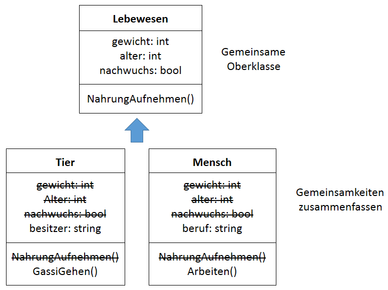
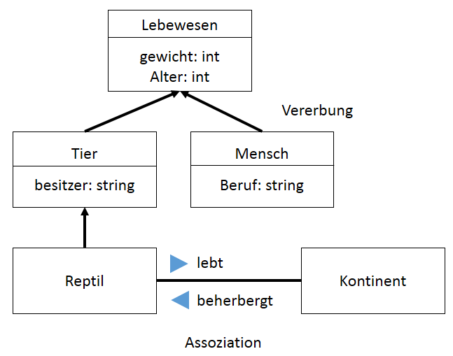

# Vererbung

Die Vererbung ermöglicht es, neue Klassen zu erstellen, die das in anderen Klassen definierte Verhalten wiederverwenden, erweitern und ändern.

---

<!-- .slide: class="left" -->
## Problemstellung

Oft werden mehrere Klassen benötigt, die in weiten Teilen gleiche Funktionalitäten bereitstellen und gleiche Eigenschaften haben.

Zum Beispiel bei den Klassen **Mensch** und **Tier**.

* viel Schreibarbeit

* mehrfacher Code

* bei Änderungen müssen alle Klassen angepasst werden

**Lösung:**

Man versucht, zu ähnlichen Klassen, eine gemeinsame **Oberklasse** zu finden die alle Gemeinsamkeiten beinhaltet. In den **Unterklassen** werden lediglich die Unterschiede ergänzt.

---

<!-- .slide: class="left" -->
## Vererbung



---

<!-- .slide: class="left" -->
## Vererbung

Die Vererbung (Ableitung) erlaubt die Definition neuer Klassen auf der Basis von bestehenden Klassen. Dabei werden Eigenschaften und Methoden übernommen.

Die Klasse deren Member vererbt werden, wird **Basisklasse/Elternklasse/Oberklasse** genannt, und die Klasse, die diese Member erbt, wird **abgeleitete Klasse/Kindklasse/Unterklasse** genannt.

**Beispiel:** Eine Basisklasse **Lebewesen** kann eine abgeleitete Klasse **Tier** und eine weitere abgeleitete Klasse **Reptil** haben. Also ein Reptil ist ein Tier und ein Tier ist ein Lebewesen.

Note: Person

Mitarbeiter        Kunde

fest Angestellter     Leiharbeiter

---

<!-- .slide: class="left" -->
## Beispiel



Note: 
* **Ist ein** oder **ist eine Art von**
* Assoziation = Beziehung, keine Vererbung
* **ÜBUNG 4** Klassendiagramm

---

<!-- .slide: class="left" -->
## Beispiel


Note: Konstruktor und private Elemente werden nicht vererbt.

ChangeRequest kann alle Methoden und Variabeln von der Basisklasse verwenden

---

<!-- .slide: class="left" -->
## Syntax

```csharp
class <abgeleitete Klasse> : <Basisklasse>
{
    ...
}
```

Die Implementierung der Vererbung in C\#

```csharp
class Mensch : Lebewesen
{
    ...
}
```

---

<!-- .slide: class="left" -->
## Vererbung und Konstruktoren

* Es werden keine Konstruktoren vererbt!

* Von der Kindklasse wird der parameterlose Konstruktor der Basisklasse aufgerufen wenn kein anderer Konstruktor definiert wurde.

* Besitzt die Basisklasse einen Konstruktor mit Parameter (und keinen ohne Parameter) wird dieser nicht aufgerufen. In diesem Fall muss (wenn ein Konstruktor nötig ist) der Konstruktor aus der abgeleiteten Klasse explizit aufgerufen werden.

```csharp
: base(Parameter)
```

---

<!-- .slide: class="left" -->
### Base

Um aus einer abgeleiteten Klasse auf die Basisklasse zuzugreifen gibt es das Schlüsselwort [Base](https://docs.microsoft.com/de-de/dotnet/csharp/language-reference/keywords/base):

* Einen Konstruktor der Basisklasse aufrufen:

```csharp
public Person(string beruf, string name, int alter) : base(name, alter)
```

* Auf eine Methode oder Eigenschaft der Basisklasse zugreifen:

```csharp
base.Name = "Fritz";
```

Note: 

* **VS** Beispiel Vererbung
* In **VS** zeigen:
    * Reihenfolge von Konstruktoraufrufe
    * region --> wenn Gliederung in VS aktiv ist
    * Klasse erstellen mit zwei Methoden
    * Aufruf der Methoden
    * Aufruf Konstruktor
* **ÜBUNG 5** Medienverwaltung Aufgabe 3

---

<!-- .slide: class="left" -->
## Weitere Schlüsselworte

* [virtual:](https://docs.microsoft.com/de-de/dotnet/csharp/language-reference/keywords/virtual) Wird ein Klassenmember in der Basisklasse mit virtual deklariert kann er später von einer abgeleiteten Klasse überschrieben werden.

* [abstract:](https://docs.microsoft.com/de-de/dotnet/csharp/language-reference/keywords/abstract) Damit kann angegeben werden dass die Klasse nur als Basisklasse verwendet werden kann (es darf keine Instanz erstellt werden). Klassen die von einer abstrakten Klasse erben müssen alle Klassenmember die abstract sind implementieren und haben keine Implementierung von Code sondern nur die Definition!

* [override:](https://docs.microsoft.com/de-de/dotnet/csharp/language-reference/keywords/override) Überschreibt einen Klassenmember der als **virtual** deklariert wurde (erweitert bzw ändert Funktion der Basisklasse). Die zuletzt überschriebene Methode wird immer benutzt!

* [sealed:](https://docs.microsoft.com/de-de/dotnet/csharp/language-reference/keywords/sealed) Eine als sealed deklarierte Klasse erlaubt keine Ableitung.

Note:

* In **VS** zeigen.
    * Zeigen: Beispiel 33_Vererbung virtual override
    * Je nach Zeit gibt es später hierzu mehr.
* **ÜBUNG 6** Flugzeug