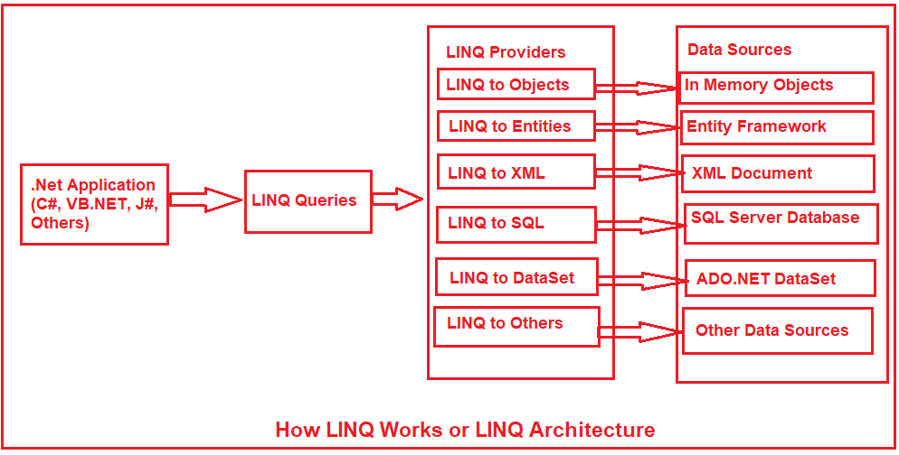

# LINQ

Daten abfragen und filtern.


<!-- .slide: class="left" -->
## Was ist LINQ

LINQ (Language-Integrated Query bzw Sprachintegrierte Abfrage) ist eine einheitliche Abfragesyntax in C# und VB.NET zum Abrufen von Daten aus verschiedenen Quellen und Formaten. Sie ist in C# oder VB integriert, wodurch die Diskrepanz zwischen Programmiersprachen und Datenbanken beseitigt wird und eine einzige Abfrageschnittstelle für verschiedene Arten von Datenquellen bereitgestellt wird.

Wie SQL ist [LINQ](https://docs.microsoft.com/de-de/dotnet/csharp/programming-guide/concepts/linq/introduction-to-linq-queries) eine strukturierte Abfragesyntax um Daten aus verschiedenen Arten von Datenquellen wie Sammlungen, ADO.Net DataSet, XML Dokumente, Webservice und Datenbanken abzurufen.

Note: Aussprache: Link


<!-- .slide: class="left" -->
### LINQ Benutzung



Note: Verschiedene LINQ Provider z.B. LINQ-to-SQL, LINQ-to-XML, LINQ-to-DataSets, ...


<!-- .slide: class="left" -->
### LINQ Abfragen

LINQ-Abfragen geben Ergebnisse als Objekte zurück. So können Sie einen objektorientierten Ansatz für die Ergebnismenge verwenden und müssen sich nicht um die Umwandlung verschiedener Ergebnisformate in Objekte kümmern.


<!-- .slide: class="left" -->
### Vorteile von LINQ

* **Vertraute Sprache:** Entwickler müssen nicht für jede Art von Datenquelle oder Datenformat eine neue Abfragesprache erlernen.
* **Weniger Kodierung:** Die Menge des zu schreibenden Codes wird im Vergleich zu einem traditionelleren Ansatz reduziert.
* **Lesbarer Code:** LINQ macht den Code besser lesbar (leicht verstehen und pflegen).
* **Standardisierte Art der Abfrage mehrerer Datenquellen:** Die gleiche LINQ-Syntax kann für die Abfrage mehrerer Datenquellen verwendet werden.
* **Kompilierzeitsicherheit von Abfragen:** Es bietet Typüberprüfung von Objekten zur Kompilierzeit.
* **IntelliSense-Unterstützung:** LINQ bietet IntelliSense an.


<!-- .slide: class="left" -->
## Syntaxvarianten

* Abfragensyntax (Query syntax)
* Methodensyntax (Method syntax / Fluent syntax)

```csharp
var names = new List<string>()  
{  
    "John Doe",  
    "Jane Doe",  
    "Jenna Doe",  
    "Joe Doe"  
};  
```

```csharp
// Alle Namen holen welche 8 oder weniger Zeichen haben
// Abfragesyntax
var shortNames = from name in names where name.Length <= 8 orderby name.Length select name;

// Methodensyntax
var shortNames = names.Where(name => name.Length <= 8).OrderBy(name => name.Length);

// Daten abfragen und ausgeben
foreach (var name in shortNames)  
{
    Console.WriteLine(name);
}

```

Note: In nur einer Zeile kann man z.B. alle Namen abfragen welche 8 oder weniger Zeichen lang sind und der Länge nach sortieren


<!-- .slide: class="left" -->
### LINQ Methodensyntax

Bei [Lambda Expressions](https://docs.microsoft.com/de-de/dotnet/csharp/programming-guide/statements-expressions-operators/lambda-expressions) werden anonyme Methoden aufgerufen. [weiteres zu Lambda Expressions](https://www.tutorialsteacher.com/linq/linq-lambda-expression)


```csharp
var numbers = new List<int>()
{
    1, 7, 2, 61, 14
};
```

```csharp
var sortNum = numbers.OrderBy(number => number).ToList();
```

Note: Abfrage wird erst ausgeführt wenn mit den Daten gearbeitet wird z.B. iterieren, ToList(), Count(),  D.h. es sind Abfragen über mehrere Zeilen möglich.


<!-- .slide: class="left" -->
### Standard Abfrageoperatoren

Standard-Abfrageoperatoren können auf der von ihnen bereitgestellten Funktionalität klassifiziert werden.

Klassifizierung | Standard Query Operatoren
--------------- | ------------------------
Filterung | Where, OfType
Sortierung | OrderBy, OrderByDescending, ThenBy, ThenByDescending, Reverse
Gruppieren | GroupBy, ToLookup
Verbinden | GroupJoin, Join
Projektion | Select, SelectMany
Aggregation | Aggregate, Average, Count, LongCount, Max, Min, Sum
Quantifizieren | All, Any, Contains


<!-- .slide: class="left" -->
Klassifizierung | Standard Query Operatoren
--------------- | ------------------------
Element | ElementAt, ElementAtOrDefault, First, FirstOrDefault, Last, LastOrDefault, Single, SingleOrDefault
Set | Distinct, Except, Intersect, Union
Aufteilung | Skip, SkipWhile, Take, TakeWhile
Verkettung | Concat
Gleichheit | SequenceEqual
Generation | DefaultEmpty, Empty, Range, Repeat
Konvertierung | AsEnumerable, AsQueryable, Cast, ToArray, ToDictionary, ToList

Note: 
* OrderBy ist aufsteigend
* ToLookup ist dasselbe wie GroupBy; der einzige Unterschied ist, dass die Ausführung von GroupBy aufgeschoben wird, während ToLookup sofort ausgeführt wird.


<!-- .slide: class="left" -->
### LINQ Beispiel

```csharp
var users = new List<User>()
{
    new User() { Name = "John Doe", Age = 42 },
    new User() { Name = "Jane Doe", Age = 34 },
    new User() { Name = "Joe Doe", Age = 8 },
    new User() { Name = "Another Doe", Age = 15 },
};

// Nur das Feld Name abfragen
var names = users.Select(x => x.Name).ToList();

// Ein Benutzer mit dem Alter von 8 abfragen. Wird keiner gefunden wird null geliefert
var temp = users.Where(x => x.Age == 8).FirstOrDefault();
var temp = users.First(x => x.Age == 10); // Exception

// Wieviel Elemente gibt es welche ein Alter größer 20 haben
int count = users.Where(x => x.Age > 20).Count();
// Bessere ALternative
int count = users.Count(x => x.Age > 20);

List<User> sortedUsers = users.OrderBy(user => user.Age).ThenByDescending(user => user.Name).ToList();

```


<!-- .slide: class="left" -->
### Konvertierungsoperatoren

Die Konvertierungsoperatoren in LINQ sind nützlich, um den Typ der Elemente in eine Sammlung zu konvertieren. Es gibt drei Arten von Konvertierungsoperatoren: As-Operatoren (AsEnumerable und AsQueryable), To-Operatoren (ToArray, ToDictionary, ToList und ToLookup) und Casting-Operatoren (Cast und OfType).

Methode | Beschreibung
-------| -----------
AsEnumerable | Gibt die Eingabe zurück als `IEnumerable<t>`
AsQueryable | Konvertiert die Eingabe zu einem IQueryable um einen Suchprovider zu simulieren.
ToArray | Konvertiert die EIngabe in ein Array
ToDictionary | Fügt Elemente in ein Dictionary ein, das auf einer Schlüsselselektor-Funktion basiert
ToList | Konvertiert eine Collection in eine Liste

Note: 
Zeigen LINQ in VS
**ÜBUNG** LINQ
