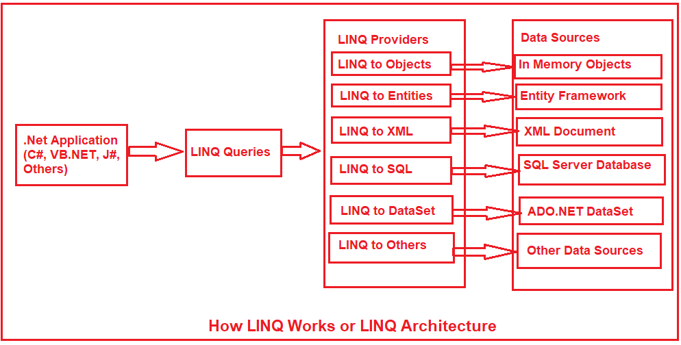
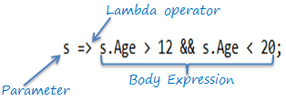

# LINQ

Daten abfragen und filtern.

---

<!-- .slide: class="left" -->
## Was ist LINQ

[LINQ](https://docs.microsoft.com/de-de/dotnet/csharp/programming-guide/concepts/linq/introduction-to-linq-queries) (Language-Integrated Query bzw sprachintegrierte Abfrage) ist eine einheitliche Abfragesyntax zum Abrufen von Daten aus verschiedenen Quellen und Formaten. 

Sie ist in C\# integriert, wodurch die Unterscheidung zwischen Programmiersprachen und Datenbanksystemen bzw Datenformaten beseitigt wird und eine einzige Abfrageschnittstelle für verschiedene Arten von Datenquellen bereitgestellt wird.

Note: 
* Aussprache: Link
* Daten aus verschiedenen Datenquellen abrufen:
  *  Collections
  *  ADO.Net-DataSet
  *  XML-Dokumente
  *  Webservices
  *  Datenbanken

---

<!-- .slide: class="left" -->
### LINQ Benutzung



Note:

* Verschiedene LINQ Provider

---

<!-- .slide: class="left" -->
### Vorteile von LINQ

* **Vertraute Sprache:** Entwickler müssen nicht für jede Art von Datenquelle oder Datenformat eine neue Abfragesprache erlernen.
* **Weniger Code:** Die Menge des zu schreibenden Codes wird im Vergleich zu einem Hersteller spezifischen Formats reduziert.
* **Lesbarer Code:** LINQ macht den Code besser les- und pflegbar.
* **Standardisierte Abfrage mehrerer Datenquellen:** Die gleiche LINQ-Syntax kann für die Abfrage mehrerer Datenquellen verwendet werden.
* **IntelliSense-Unterstützung:** LINQ bietet IntelliSense an.

---

<!-- .slide: class="left" -->
### LINQ Abfragen

LINQ-Abfragen geben Ergebnisse als Objekte zurück. So muss man sich nicht um die Umwandlung verschiedener Formate in Objekte kümmern.


---

<!-- .slide: class="left" -->
## Syntaxvarianten

* Abfragesyntax (Query syntax)
* Methodensyntax (Method syntax / Fluent syntax)

```csharp []
var names = new List<string>()  
{  
    "John Doe",  
    "Jane Doe",  
    "Jenna Doe",  
    "Joe Doe"  
};  

// Alle Namen holen welche 8 oder weniger Zeichen haben
// Abfragesyntax
var shortNames = from name in names where name.Length <= 8 orderby name.Length select name;

// Methodensyntax
var shortNames = names.Where(name => name.Length <= 8).OrderBy(o => o.Length);

// Daten abfragen und ausgeben
foreach (var name in shortNames)  
{
    Console.WriteLine(name);
}

```

Note: 
* wie im Beispiel sichtbar, kann man sehr einfach Daten mit nur einer Zeile Code abrufen.
* Die Methodensyntax sieht aus wie Methodenaufrufe.
  * Nutzt `=>`-Operator (Lambda)
  * anonyme Methoden

---

<!-- .slide: class="left" -->
### Anonyme Methoden

Eine anonyme Methode ist eine Methode, die keinen Namen hat. Sie wird direkt an eine Variable oder Delegaten gebunden. 

Dies kann nützlich sein, wenn man eine Methode nur einmal oder direkt in einer bestimmten Situation benötigt.

```csharp
Func<int, int> verdoppeln = delegate (int x)
{
    return x * 2;
};

Console.WriteLine(verdoppeln(5)); // Ausgabe: 10
```

Note: 
* Erklärung:
  * `Func<int, int>`: Diese Methode nimmt einen `int` und gibt einen `int` zurück.
  * `delegate (int x) { return x * 2; }` ist die anonyme Methode.
  * Sie sagt: "Nimm ein Argument x und gib das Doppelte zurück."
* Delegate: ist ein Typ, der die Signatur einer Methode beschreibt. Jede Methode mit der passenden Signatur (Parameter und Rückgabewert) kann einem Delegate zugewiesen werden.
* Anonyme Methoden: Älter und etwas ausführlicher, aber immer noch nützlich.
* Genutzt bei:
  * Ereignissen (UI z.B Button Klick)
  * Kurzfristige Verarbeitung (Wenn du eine einmalige Berechnung/Aktion durchführen möchtest, ohne die Methode an mehreren Stellen zu verwenden)
  * Code, der keinen Namen oder Wiederverwendung benötigt.

---

<!-- .slide: class="left" -->
### Lambda-Ausdrücke

[Lambda-Ausdrücke](https://docs.microsoft.com/de-de/dotnet/csharp/programming-guide/statements-expressions-operators/lambda-expressions) sind eine kompaktere Schreibweise für anonyme Methoden. Sie verwenden den `=>`-Operator.

```csharp
Func<int, int> verdoppeln = x => x * 2;

Console.WriteLine(verdoppeln(5)); // Ausgabe: 10
```

[weiteres zu Lambda Expressions](https://www.tutorialsteacher.com/linq/linq-lambda-expression)



Note:
* `x => x * 2` bedeutet: "Nimm ein Argument x und gib das Ergebnis von `x * 2` zurück."
* Hier brauchen wir weder das Schlüsselwort `delegate` noch geschweifte Klammern für eine einfache Operation.
* Lambda-Ausdrücke: Die modernere, kompakte Schreibweise für anonyme Methoden.

---

<!-- .slide: class="left" -->
### Beispiel

Eine Methode, die überprüft, ob ein Name mit "A" beginnt, zuerst als anonyme Methode:

```csharp
Func<string, bool> beginntMitA = delegate (string name)
{
    return name.StartsWith("A");
};
```

Als Lambda-Ausdruck:

```csharp
Func<string, bool> beginntMitA = name => name.StartsWith("A");
```

---

<!-- .slide: class="left" -->
### LINQ Methodensyntax

```csharp []
var numbers = new List<int>()
{
    1, 7, 2, 61, 14
};
```

```csharp []
var sortNum = numbers.OrderBy(number => number).ToList();
```

Note: 
* `OrderBy`: aufsteigend (1-9)
* Abfrage wird erst ausgeführt wenn mit den Daten gearbeitet wird z.B. iteriert, `ToList()`, `Count()`,  D.h. es sind Abfragen über mehrere Zeilen möglich.

---

<!-- .slide: class="left" -->
### Standard-Abfrageoperatoren

Standard-Abfrageoperatoren können auf der von ihnen bereitgestellten Funktionalität klassifiziert werden.

Klassifizierung | Standard Query Operatoren
--------------- | ------------------------
Filterung | `Where`, `OfType`
Sortierung | `OrderBy`, `OrderByDescending`, `ThenBy`, `ThenByDescending`, `Reverse`
Gruppieren | `GroupBy`, `ToLookup`
Verbinden | `GroupJoin`, `Join`
Projektion | `Select`, `SelectMany`
Aggregation | `Aggregate`, `Average`, `Count`, `LongCount`, `Max`, `Min`, `Sum`
Quantifizieren | `All`, `Any`, `Contains`

Note:
* `OrderBy`: aufsteigend (1-9)
* `Descending`: absteigend (9 -1)
* `Reverse`: Sortierung umdrehen
* `ToLookup`: dasselbe wie `GroupBy`; der einzige Unterschied ist, dass die Ausführung von `GroupBy` aufgeschoben wird, während `ToLookup` sofort ausgeführt wird.
* `GroupBy`: Daten Gruppieren, oft zusammen mit `Select` um zu definiert, wie die Gruppen verarbeitet oder dargestellt werden.
* `All`: gibt `true` zurück wenn alle Elemente eine bestimmte Bedingung erfüllen
* `Any`: Prüft ob ein Element eine bestimmte Bedingung erfüllt.

---

<!-- .slide: class="left" -->
Klassifizierung | Standard Query Operatoren
--------------- | ------------------------
Element | `ElementAt`, `ElementAtOrDefault`, `First`, `FirstOrDefault`, `Last`, `LastOrDefault`, `Single`, `SingleOrDefault`
Set | `Distinct`, `Except`, `Intersect`, `Union`
Aufteilung | `Skip`, `SkipWhile`, `Take`, `TakeWhile`
Verkettung | `Concat`
Generation | `DefaultEmpty`, `Empty`, `Range`, `Repeat`

Note:
* `ElementAt`: Das Element am angegebenen Index
* `Single`: Ein Element, Fehler wenn keines oder mehrere gefunden.
* `Concat` Items von der ersten gefolgt von items der zweiten Liste
* `Union`: Concat gefolgt von Distinct.

---

<!-- .slide: class="left" -->
### Konvertierungsoperatoren

Die Konvertierungsoperatoren in LINQ sind nützlich, um den Typ der Elemente in eine Sammlung zu konvertieren. 

Methode | Beschreibung
--------| -----------
`AsEnumerable` | Gibt die Eingabe zurück als `IEnumerable<T>`
`AsQueryable` | Konvertiert die Eingabe zu einem `IQueryable` um einen Suchprovider zu simulieren.
`ToArray` | Konvertiert die Eingabe in ein `Array`
`ToDictionary` | Konvertiert Elemente in ein `Dictionary`
`ToList` | Konvertiert eine Collection in eine `List<T>`

---

<!-- .slide: class="left" -->
### LINQ Beispiel

```csharp []
var users = new List<User>()
{
    new User() { Name = "John Doe", Age = 42 },
    new User() { Name = "Jane Doe", Age = 34 },
    new User() { Name = "Joe Doe", Age = 8 },
    new User() { Name = "Another Doe", Age = 15 },
};

// Nur das Feld "Name" abfragen
var names = users.Select(x => x.Name).ToList();

// Ein Benutzer mit dem Alter von 8 abfragen. Wird keiner gefunden wird null geliefert
var temp = users.Where(x => x.Age == 8).FirstOrDefault();
var temp = users.First(x => x.Age == 10); // Exception

// Wie viele Elemente gibt es, welche ein Alter größer 20 haben
int count = users.Where(x => x.Age > 20).Count();
// Alternative
int count = users.Count(x => x.Age > 20);

List<User> sortedUsers = users.OrderBy(user => user.Age).ThenByDescending(user => user.Name).ToList();

```

Note:
* Zeigen LINQ in **VS**
* **ÜBUNG 9** LINQ
