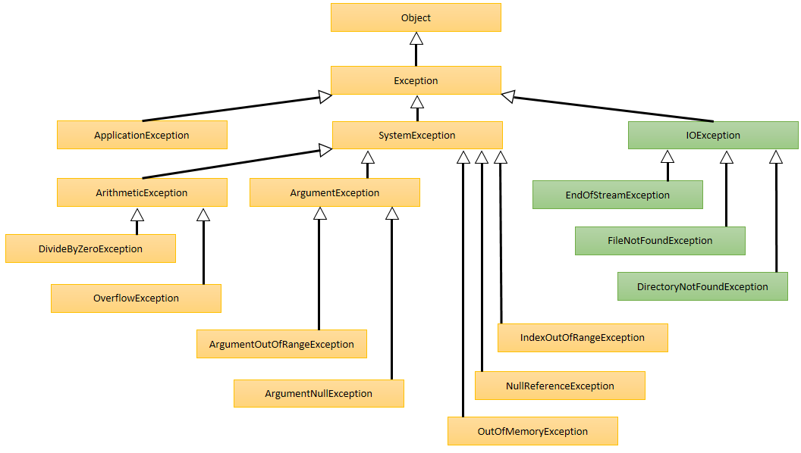

# Fehlerbehandlung

Fehler abfangen und behandeln.

---

<!-- .slide: class="left" -->
## Fehlerarten

* **Syntaxfehler:** Syntaxfehler entstehen, wenn sich der Programmierer nicht an die Syntax von C\# hält. Dies passiert durch vertippen oder wenn reservierte Wörter und Methoden in einem falschen Zusammenhang verwendet werden.

* **Laufzeitfehler:** Treten während der Ausführung auf, nachdem das Programm kompiliert worden ist. Typische Laufzeitfehler sind:

  * Es soll eine Datei gelesen werden, die aber nicht vorhanden ist.

  * Wenn für eine Berechnung ein Wert benötigt wird, dieser ab nicht eingegeben wurde.

* **Logische Fehler:** Logische Fehler werden vom Compiler nicht erkannt, da es sich hierbei um Fehler in der Programmlogik handelt. Sie entstehen durch fehlerhafte Berechnungsformeln oder Fehler in der Anwendungslogik.

Note: Syntaxfehler werden in VS angezeigt

---

<!-- .slide: class="left" -->
## Strukturierte Fehlerbehandlung

Die strukturierte Ausnahmebehandlung ermöglicht während der Laufzeit
eine stabile und umfassende Fehlerbehandlung.

* **try:** Mit der try-Anweisung wird der unsichere Programmcode, der Programmcode, der möglicherweise zu einem Fehler führen kann, gekapselt.

* **catch:** Dem Try Codeblock werden dann ein oder mehrere catch-Blöcke zur Fehlerbehandlung zugewiesen, die beim eintreten eines bestimmten Fehlers abgearbeitet werden sollen.

* **finally:** In einem abschließenden finally-Block, der in jedem Fall ausgeführt wird (immer), lassen sich Bereinigungsaufgaben durchführen oder Ressourcen freigeben (das Schließen von Dateien).

Note: Ohne Try catch Programmfehler oder unsicherer Zustand (Dateizugriffe oder SQL Operationen)

---

<!-- .slide: class="left" -->
## Ablauf Fehlerbehandlung


---

<!-- .slide: class="left" -->
### Syntax für try-catch-finally

```csharp []
try
{
  ...
}
catch (ExceptionType ExceptionName)
{
  ...
}
[finally]
{
  ...
}]
```

Mehr zum Thema [Try-Catch](https://docs.microsoft.com/de-de/dotnet/csharp/language-reference/keywords/try-catch) und [Best practices für Fehlerbehandlung](https://docs.microsoft.com/de-de/dotnet/standard/exceptions/best-practices-for-exceptions)

---

<!-- .slide: class="left" -->
### Beispiel

```csharp []
static void Main(string[] args)
{
  int x = 10;
  int y = 0;

  try
  {
    x = x / y;
  }
  catch (DivideByZeroException e)
  {
    Console.WriteLine(e.Message);
  }
  catch (Exception ex)
  {
    Console.WriteLine(ex.ToString());
  }
  finally
  {
    Console.WriteLine("Der finally-Block wurde aufgerufen.");
  }
}
```

---

<!-- .slide: class="left" -->
## Übersicht Exceptions



[Liste über System-Exceptions](https://www.completecsharptutorial.com/basic/complete-system-exception.php) und [eigene Exceptions](https://docs.microsoft.com/de-de/dotnet/standard/exceptions/how-to-create-user-defined-exceptions)

Note: Datei Fehler z.B. in System.IO Namespace

---

<!-- .slide: class="left" -->
## Throw

Mit [Throw](https://docs.microsoft.com/de-de/dotnet/csharp/language-reference/keywords/throw) kann eine Exception manuell ausgelöst werden. 

```csharp []
public class NumberGenerator
{
   int[] numbers = { 2, 4, 6, 8, 10, 12, 14, 16, 18, 20 };

   public int GetNumber(int index)
   {
      // Prüfen ob der Wert von 'index' gültig ist.
      if (index < 0 || index >= numbers.Length)
      {
          // Fehler werfen
          throw new IndexOutOfRangeException();
      }
      return numbers[index];
   }
}
```

---

<!-- .slide: class="left" -->
```csharp []
public static void Main()
{
  var gen = new NumberGenerator();
  int index = 10;
  try
  {
      int value = gen.GetNumber(index);
      Console.WriteLine($"Retrieved {value}");
  }
  // Fehler abfangen.
  catch (IndexOutOfRangeException e)
  {
      Console.WriteLine($"{e.GetType().Name}: {index} is outside the bounds of the array"); 
      // IndexOutOfRangeException: 10 is outside the bounds of the array
  }
}
```

Note: 
* **VS** Exception herbeirufen (z.B. Verwendung eines null-Objects).  
  * Abfangen zeigen. Throw zweigen. Bedingte Breakpoints.

---

<!-- .slide: class="left" -->
## Eigene Ausnahmen

C# beinhaltet einige vordefinierte Fehlerklassen. Jedoch kann es sinnvoll sein, wenn die Geschäftslogik fehlschlägt, eine [benutzerdefinierte Ausnahmeklasse](https://docs.microsoft.com/de-de/dotnet/standard/exceptions/how-to-create-user-defined-exceptions) zu verwenden.

z.B. NotFound, Forbidden, ForeignApiCall, BadArgument

```csharp []
[Serializable]
public class InvalidStudentNameException : Exception
{
    public InvalidStudentNameException() 
    {  
    }

    public InvalidStudentNameException(string name)
        : base(name)
    {
    }
}
```

Note:

* Beispiel hierzu in Visual Studio zeigen
