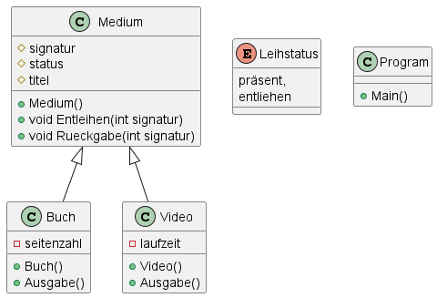

# Übung - Medienverwaltung Aufgabe 3

## Teil 1 - Vererbung

Unsere Medienverwaltung beinhaltet aktuell viele redundante Felder und Methoden. Ändern Sie dies indem Sie eine Basisklasse `Medium` einführen welche alle redundanten Daten beinhaltet.

### Klassenhierarchie



D.h. `Buch` und `Video` erben von `Medium`.

In den erbenden Klassen werden nur die Eigenschaften und Methoden definiert welche nur dort benutzt werden. Alle anderen Eigenschaften und Methoden können die Klassen aus der `Medium`-Klasse beziehen (erben).

## Teil 2 - Konstruktor

Die Zuweisung der Werte soll nicht mehr mit der Methode `Anlegen()` geschehen sondern mit dem Konstruktor der jeweiligen Klasse. D.h. beim Instanziieren eines neuen Objekts wird automatisch der Konstruktor aufgerufen.

Die allgemein gültigen Daten werden im `Medium()`-Konstruktor abgefragt. Die Video oder Bücher spezifischen Daten im Konstruktor von `Video()` oder `Buch()`.

**Hinweis:** Bei vererbenden Klassen wird zusätzlich zum Aufruf des eigenen Konstruktors auch der Konstruktor der Basisklasse aufgerufen wenn der Standardkonstruktor (`Klassenname()`) genutzt wird.

## Teil 3 - sonstige Erweiterungen

### Kommandos

|Kommando    | Aktion
-------------|----------
|„b“| Hinzufügen und Initialisieren eines neuen Buches|
|„v“| Hinzufügen und Initialisieren eines neuen Videos|
|„a“| Anzeigen der Eigenschaften aller angelegten Objekte|
|„e Signatur“| Entleihen des durch die Signatur bezeichneten Objekts. z.B. e 5776|
|„r Signatur“| Rückgabe des durch die Signatur bezeichneten Objekts
|„q“|Programm beenden|

### Beispiel Ausgabe

```bash
Signatur     Typ       Titel      Leihstatus   Eigenschaften
12553        Video     Gladiator  präsent      Dauer 110.50 min
5778         Buch      Faust      entliehen    Seitenzahl 325
```