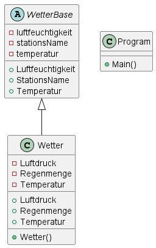

# Übung - Wetterstation

## Klassendiagramm



## Basisklasse

Erstellen Sie eine Basis-Klasse `WetterBase` mit drei privaten Attributen. Von der Klasse selbst darf keine Instanz erzeugt werden dürfen (besonderes Schlüsselwort notwendig).

Der Zugriff auf die Attribute soll über Eigenschaften (Properties) erfolgen. In den Eigenschaften soll auf die minimal und maximal Werte geprüft werden. Ist ein Wert höher als der erlaubte Höchstwert wird der Höchstwert als aktueller Wert gesetzt. Ebenso beim Minimalwert.

Folgende Klassenmember sollen implementiert werden:

* Temperatur ( -40 - + 80)
* Feuchtigkeit (0 – 100)
* Stationsname

## Abgeleitete Klasse

Erstellen Sie eine abgeleitete Klasse `Wetter` die folgende Klassenmember hat:

* Einen Konstruktor mit fünf Parametern welcher ebenfalls den Konstruktor der Basisklasse aufruft

    * Stationsname
    * Temperatur
    * Feuchtigkeit
    * Luftdruck
    * Regenmenge

* Temperatur (-80 - +80) überschreibt die Eigenschaft aus der Basisklasse (besonderes Schlüsselwort notwendig)
* Luftdruck (700 – 1500)
* Regenmenge (0 – 100)

## Weiteres

Von der Klasse `Wetter` darf keine weitere Klasse abgeleitet werden. Verbieten Sie dies explizit.

In der `Main()` erstellen Sie die Instanzen der `Wetter`-Klasse. Dies kann statisch (keine manuell Eingabe der Werte notwendig) erfolgen z.B.:

```bash
new Wetter("Station Scott", -55, -2, 800, 0);
new Wetter("Station Tunis", 80, 30, 1030, 0);
new Wetter("Station Wien", 15, 70, 930, 3);
```

Speichern sie die erstellten Objekte in einer Collection z.B. `List<Wetter>` und geben Sie am Ende von allen Stationen den Namen, die Temperatur, die Luftfeuchtigkeit, den Luftdruck und die Regenmenge aus.

### Ausgabe

```bash
Station Scott Temperatur: -55 Feuchtigkeit: 0 Luftdruck: 800 Regenmenge: 0
Station Tunis Temperatur: 80 Feuchtigkeit: 30 Luftdruck: 1030 Regenmenge: 0
Station Wien Temperatur: 15 Feuchtigkeit: 70 Luftdruck: 930 Regenmenge: 3
```
